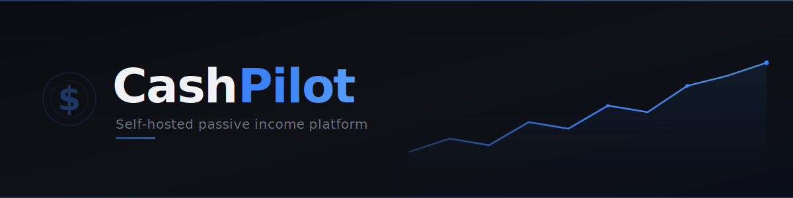
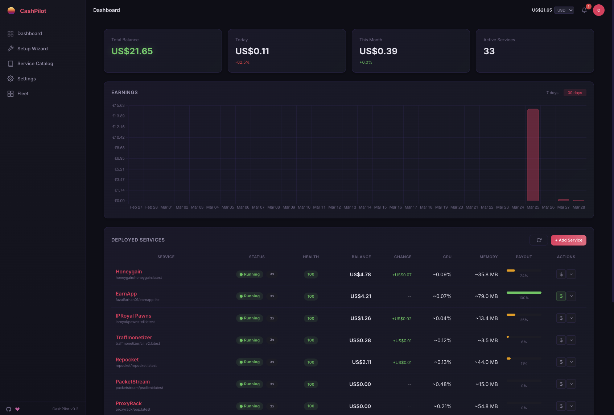

<p align="center">
  
</p>

<p align="center">
  <a href="https://hub.docker.com/r/drumsergio/cashpilot"></a>
  <a href="https://github.com/GeiserX/CashPilot/stargazers"></a>
  <a href="LICENSE"></a>
</p>

---

## What is CashPilot?

CashPilot is a self-hosted platform that lets you deploy, manage, and monitor passive income services from a single web interface. Instead of manually setting up dozens of Docker containers, configuring credentials, and checking multiple dashboards, CashPilot handles everything from one place.

The key differentiator: a browser-based setup wizard guides you through account creation and service deployment, orchestrates all containers through Docker, and aggregates your earnings into a unified dashboard with historical tracking.



## Features

- **Web-based setup wizard** with guided account creation for each service
- **One-click container deployment** for 25+ passive income services
- **Real-time earnings dashboard** with historical charts and trend analysis
- **Container health monitoring** -- CPU, memory, network, and uptime at a glance
- **Multi-category support** -- bandwidth sharing, DePIN, storage sharing, GPU compute
- **Automatic earnings collection** from service APIs and dashboards
- **Mobile-responsive dark UI** -- manage your fleet from any device
- **Single Docker container** -- no complex setup, no dependencies to install
- **Service catalog** with earning estimates, requirements, and platform details

## Quick Start

With Docker Compose (recommended):

```bash
docker compose up -d
# Open http://localhost:8080
```

Or with `docker run`:

```bash
docker run -d \
  --name cashpilot \
  -p 8080:8080 \
  -v /var/run/docker.sock:/var/run/docker.sock \
  -v cashpilot_data:/data \
  drumsergio/cashpilot:latest
```

Then open [http://localhost:8080](http://localhost:8080) and follow the setup wizard.

### Running without Docker socket (monitor-only mode)

If you prefer to manage containers yourself (via Portainer, manual compose, etc.), CashPilot works without Docker socket access:

```bash
docker compose -f docker-compose.standalone.yml up -d
```

In this mode CashPilot provides the service catalog, compose file export, earnings dashboard, and credential storage -- but cannot deploy or monitor containers directly. Use the **Export Compose** button in the UI to get ready-to-use `docker-compose.yml` files for any service.

## Supported Services

<!-- SERVICES_TABLE_START — DO NOT EDIT MANUALLY. Run: python scripts/generate_docs.py -->
### Docker-Deployable Services

Services CashPilot can deploy and manage automatically via Docker.

| Service | Residential IP | VPS IP | Devices / Acct | Devices / IP | Payout |
|---------|:-:|:-:|:-:|:-:|--------|
| [Bitping](https://app.bitping.com) | ✅ | ✅ | Unlimited | 1 | Crypto (SOL) |
| [Earn.fm](https://earn.fm/ref/GEISYB91) | ✅ | ✅ | Unlimited | 1 | Crypto |
| [EarnApp](https://earnapp.com/i/TSMD9wSm) | ✅ | ❌ | 15 | 1 | PayPal, Gift Cards |
| [Honeygain](https://dashboard.honeygain.com/ref/SERGIB4014) | ✅ | ❌ | 10 | 1 | PayPal, Crypto |
| [IPRoyal Pawns](https://pawns.app?r=19266874) | ✅ | ❌ | Unlimited | 1 | PayPal, Crypto, Bank Transfer |
| [MystNodes](https://mystnodes.co/?referral_code=do7v7YOoBBpbOstKQovX2pUvZYKia4ZhH3QIdNtE) | ✅ | ✅ | Unlimited | Unlimited | Crypto (MYST) |
| [PacketStream](https://packetstream.io/?psr=7xgZ) | ✅ | ❌ | Unlimited | 1 | PayPal |
| [ProxyBase](https://proxybase.io) | ✅ | ❌ | Unlimited | 1 | Crypto |
| [ProxyLite](https://proxylite.ru/?r=KMUPRZIZ) | ✅ | ✅ | Unlimited | 1 | Crypto, PayPal |
| [ProxyRack](https://peer.proxyrack.com/ref/mpwiok3xlaxeycnn5znqlg7ipjeutxyxr6xl7vmn) | ✅ | ✅ | 500 | 1 | PayPal, Crypto |
| [Repocket](https://repocket.com/) | ✅ | ❌ | 5 | 2 | PayPal, Crypto |
| [Storj](https://www.storj.io/node) | ✅ | ✅ | Unlimited | 1 \* | Crypto (STORJ) |
| [Traffmonetizer](https://traffmonetizer.com/?aff=2111758) | ✅ | ✅ \*\* | Unlimited | Unlimited | Crypto (USDT), PayPal |
| [URnetwork](https://ur.io) | ✅ | ✅ | Unlimited | 1 | Crypto |

> \* Storj nodes on the same /24 subnet share data allocation, reducing per-node earnings.
>
> \*\* Traffmonetizer ToS requires residential IP, but VPS nodes are accepted in practice.

### Browser Extension / Desktop Only

These services have no Docker image. CashPilot lists them in the catalog with signup links and earning estimates, but cannot deploy or monitor them.

| Service | Residential IP | VPS IP | Devices / Acct | Devices / IP | Payout | Status |
|---------|:-:|:-:|:-:|:-:|--------|--------|
| [BlockMesh (Perceptron Network)](https://blockmesh.xyz) | ✅ | ❌ | Unlimited | 1 | Crypto (BMESH) | Shady |
| [Bytebenefit](https://bytebenefit.com) | ✅ | ❌ | Unlimited | 1 | PayPal | Active |
| [Bytelixir](https://bytelixir.com/r/OYEIRE0VSZBZ) | ✅ | ❌ | Unlimited | 1 | Crypto | Active |
| [Ebesucher](https://www.ebesucher.com/?ref=geiserx) | ✅ | ✅ | Unlimited | 1 | PayPal | Active |
| [Gradient Network](https://app.gradient.network/signup?referralCode=YSKMY7) | ✅ | ❌ | Unlimited | 1 | Crypto (GRADIENT) | Active |
| [Grass](https://app.grass.io/register?referralCode=kn8FNEPnUr2tMqE) | ✅ | ❌ | Unlimited | 1 | Crypto (GRASS) | Active |
| [Nodepay](https://app.nodepay.ai/register?ref=0wzzyznen64j9zx) | ✅ | ❌ | Unlimited | 1 | Crypto (NC) | Active |
| [Teneo Protocol](https://dashboard.teneo.pro/?code=CAqef) | ✅ | ❌ | Unlimited | 1 | Crypto (TENEO) | Active |
| [Uprock](https://link.uprock.com/i/33e8492e) | ✅ | ❌ | Unlimited | 1 | Crypto | Active |

### GPU Compute

GPU-intensive computing services. Requires compatible hardware.

| Service | Residential IP | GPU | Min Storage | Payout | Status |
|---------|:-:|:-:|:-:|--------|--------|
| [Golem Network](https://golem.network) | ✅ | ❌ | 20GB | Crypto (GLM) | Active |
| [Nosana](https://nosana.io) | ✅ | ✅ | 50GB | Crypto (NOS) | Active |
| [Salad](https://salad.io) | ✅ | ✅ | N/A | PayPal, Gift Cards | Active |
| [Vast.ai](https://cloud.vast.ai/?ref_id=452772) | ✅ | ✅ | 100GB | Crypto, Bank Transfer | Active |
<!-- SERVICES_TABLE_END -->

> **Note:** The `generate_docs.py` script auto-generates this table from service YAML definitions. Earnings vary widely by location, hardware, and demand -- see individual guide pages in `docs/guides/` for details.

## How It Works

1. **Deploy CashPilot** -- a single `docker compose up -d` gets you running
2. **Open the web UI** -- browse the full service catalog at `http://localhost:8080`
3. **Browse services** -- filter by category, see earning estimates and requirements
4. **Sign up** -- each service card has a signup link; create accounts as needed
5. **Enter your credentials** -- the setup wizard collects only what each service needs
6. **CashPilot deploys and monitors** -- containers are launched, health-checked, and earnings are tracked automatically

## Architecture

CashPilot is built as a single container that orchestrates everything:

- **Backend:** FastAPI (Python) with async task scheduling
- **Database:** SQLite -- zero configuration, backed up via the mounted volume
- **Container management:** Docker SDK for Python -- deploys and monitors service containers
- **Service definitions:** YAML files in `services/` are the single source of truth for all service metadata, Docker configuration, and earning estimates
- **Frontend:** Server-rendered templates with a responsive dark UI

```
cashpilot/
  app/            # FastAPI application
  services/       # YAML service definitions (source of truth)
    bandwidth/    # Bandwidth sharing services
    depin/        # DePIN services
    storage/      # Storage sharing services
    compute/      # GPU compute services
  scripts/        # Utilities (doc generation, etc.)
  docs/           # Documentation and guides
```

## Configuration

### Environment Variables

| Variable | Default | Description |
|----------|---------|-------------|
| `TZ` | `UTC` | Timezone for scheduling and display |
| `CASHPILOT_SECRET_KEY` | *(auto-generated)* | Encryption key for stored credentials |
| `CASHPILOT_COLLECTION_INTERVAL` | `3600` | Seconds between earnings collection cycles |
| `CASHPILOT_PORT` | `8080` | Web UI port inside the container |
| `CASHPILOT_ROLE` | `master` | Instance role: `master` (fleet aggregation) or `child` (reports to master) |
| `CASHPILOT_NODE_NAME` | *(hostname)* | Display name for this node in the fleet dashboard |
| `CASHPILOT_MASTER_URL` | -- | WebSocket URL of the master instance (child only), e.g. `ws://master-ip:8080/ws/federation` |
| `CASHPILOT_JOIN_TOKEN` | -- | Join token issued by the master (child only) |

## Multi-Node Fleet Management

For power users running services across multiple servers, CashPilot supports a federated master/child architecture. Every node runs a **full CashPilot instance** with its own dashboard. One instance is the **master** that aggregates everything into a unified fleet view; the rest are **children** that report upstream via outbound WebSocket.

```
Master CashPilot (fleet view + local management)
        ^                ^                ^
        | WSS            | WSS            | WSS
  Child CashPilot    Child CashPilot    Child CashPilot
  (server-1)         (server-2)         (server-N)
```

### Setting up the master

The first CashPilot instance you deploy is the master by default. No extra configuration needed -- just deploy normally:

```yaml
services:
  cashpilot:
    image: drumsergio/cashpilot:latest
    ports:
      - "8085:8080"
    volumes:
      - /var/run/docker.sock:/var/run/docker.sock
      - cashpilot_data:/data
    environment:
      - CASHPILOT_SECRET_KEY=your-secret-key
      - CASHPILOT_ROLE=master
      - CASHPILOT_NODE_NAME=main-server
      - TZ=Europe/Madrid
    restart: unless-stopped
    security_opt:
      - no-new-privileges:true

volumes:
  cashpilot_data:
```

### Adding child nodes

1. **Generate a join token** from the master's fleet dashboard or via the API:

   ```bash
   curl -b cookies.txt http://master-ip:8085/api/federation/token \
     -X POST -H "Content-Type: application/json" \
     -d '{"node_name": "server-2", "expires_hours": 720}'
   ```

2. **Deploy the child** on the remote server with the token:

   ```yaml
   services:
     cashpilot:
       image: drumsergio/cashpilot:latest
       ports:
         - "8085:8080"
       volumes:
         - /var/run/docker.sock:/var/run/docker.sock
         - cashpilot_data:/data
       environment:
         - CASHPILOT_SECRET_KEY=child-secret-key
         - CASHPILOT_ROLE=child
         - CASHPILOT_NODE_NAME=server-2
         - CASHPILOT_MASTER_URL=ws://master-ip:8085/ws/federation
         - CASHPILOT_JOIN_TOKEN=<token-from-step-1>
         - TZ=Europe/Madrid
       restart: unless-stopped
       security_opt:
         - no-new-privileges:true

   volumes:
     cashpilot_data:
   ```

The child connects outbound to the master via WebSocket -- no port forwarding or VPN needed on the child side. It works behind any NAT or firewall. The master's fleet dashboard shows all connected nodes, their services, and live status. The master can also push commands (deploy, stop, restart) to any child remotely.

### Monitor-only mode (external services)

If you manage containers yourself (via Portainer, manual compose, etc.) and don't want CashPilot to deploy or control containers, run it **without mounting the Docker socket**:

```yaml
volumes:
  # - /var/run/docker.sock:/var/run/docker.sock  # omit this
  - cashpilot_data:/data
```

In monitor-only mode, CashPilot still provides the service catalog, compose file export, earnings dashboard, and credential storage. You can combine this with the child role to report earnings and status to a master while managing containers externally. Use the **Export Compose** button in the UI to get ready-to-use `docker-compose.yml` files for any service.

## FAQ

**Is bandwidth sharing safe?**

Bandwidth sharing services generally route legitimate traffic (market research, ad verification, price comparison, content delivery) through your connection. That said, you are sharing your IP address, so review each service's terms of service and privacy policy carefully before signing up. Running these on a VPS rather than residential IP is an option for some services. **This is not legal advice -- consult with the particular services you intend to use and, if needed, seek independent legal counsel regarding your jurisdiction.**

**How much can I earn?**

Earnings vary widely based on location, number of devices, and which services you run. A realistic expectation for a single residential server running 10-15 services is **$30 - $100/month**. Adding more servers or GPU compute services can increase this significantly. The dashboard shows your actual earnings over time so you can optimize.

**Can I run on a VPS or cloud server?**

Some services require a residential IP and will not pay (or will ban) VPS/datacenter IPs. These are marked as "Residential Only" in the service catalog. Services that work on VPS are a good way to scale up without additional home hardware.

**How are credentials stored?**

All service credentials are encrypted at rest in the SQLite database using your `CASHPILOT_SECRET_KEY`. The database file lives in the mounted Docker volume (`cashpilot_data:/data`). No credentials are ever sent anywhere except to the service containers themselves.

**What about security?**

Every service CashPilot deploys runs inside its own isolated Docker container. Containers cannot access your host filesystem, other containers, or your local network unless explicitly configured to do so. CashPilot further hardens deployments with `--security-opt no-new-privileges`, preventing privilege escalation inside containers. Service credentials are encrypted at rest using Fernet symmetric encryption, and the Docker socket is the only host resource CashPilot requires.

That said, no setup is bulletproof. You are still running third-party software that routes external traffic through your network. Docker isolation significantly reduces the attack surface compared to running these services directly on your host, but it does not eliminate all risk. We recommend running CashPilot on a dedicated machine or VLAN, keeping Docker and your host OS up to date, and reviewing the open-source code of any service before deploying it.

**What happens if a service container crashes?**

CashPilot monitors container health continuously. If a service container exits unexpectedly, it is automatically restarted. The dashboard shows uptime and health status for every running service.

## Disclosure

> This project contains affiliate/referral links. If you sign up through these links, the project maintainer may earn a small commission at no extra cost to you. This helps support the development of CashPilot. You are free to replace all referral codes with your own in the Settings page.

## Contributing

Contributions are welcome. To add a new service:

1. Create a YAML file in the appropriate `services/` subdirectory following `services/_schema.yml`
2. Run `python scripts/generate_docs.py` to regenerate the README table and guide pages
3. Submit a pull request

**Do not edit the service table in this README directly** — it is auto-generated from the YAML files in `services/`. Edit the YAML source of truth instead, then run the generator.

For bug reports and feature requests, open an issue on GitHub.

## License

[GPL-3.0](LICENSE) -- Sergio Fernandez, 2026
